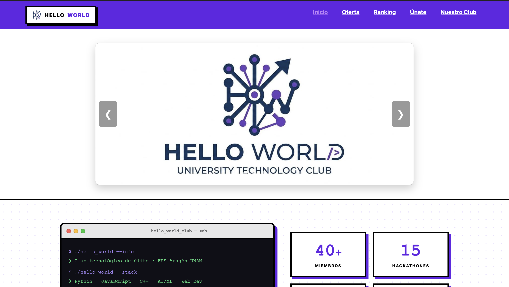
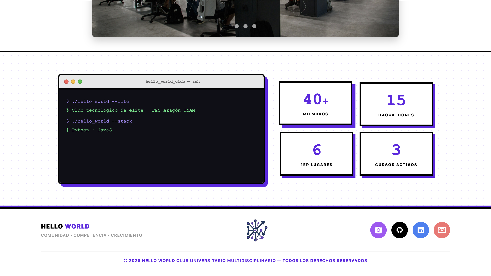
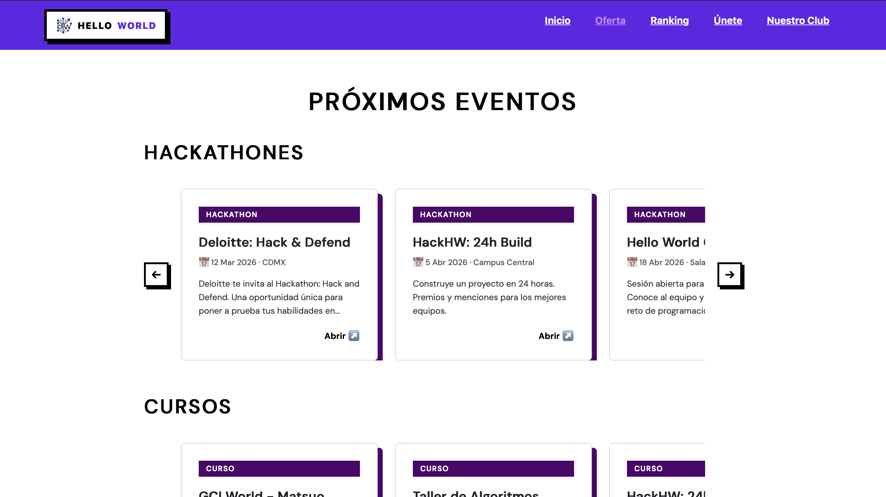
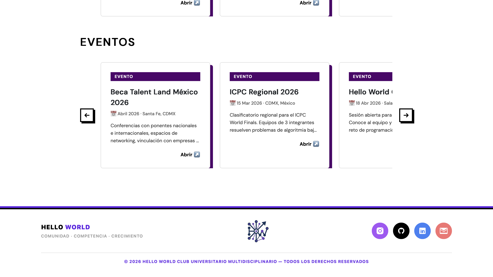
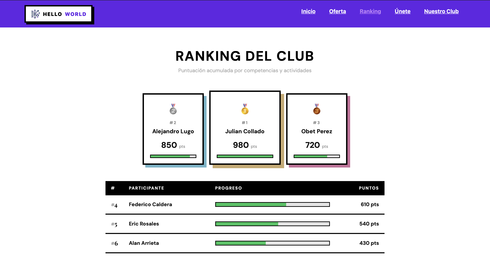
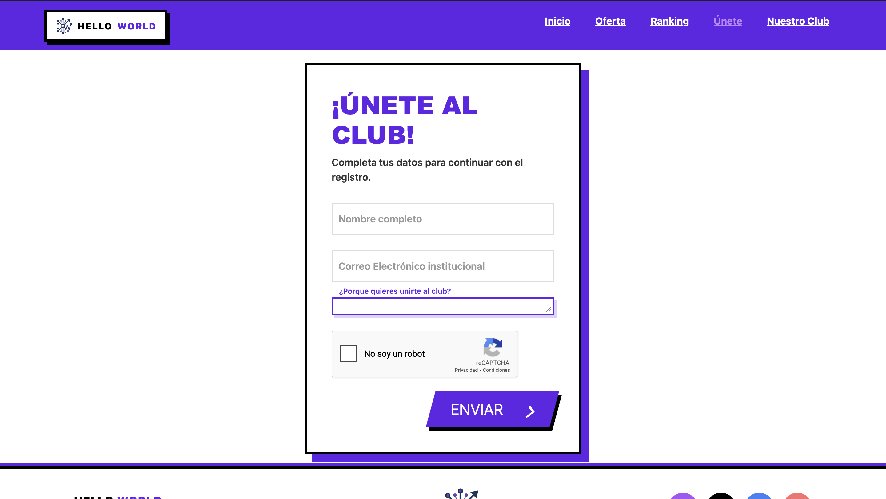
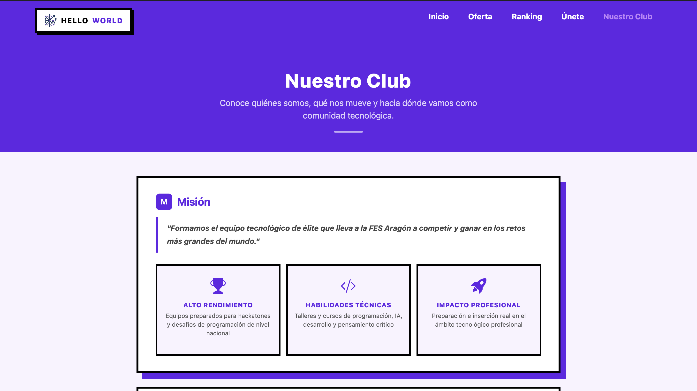
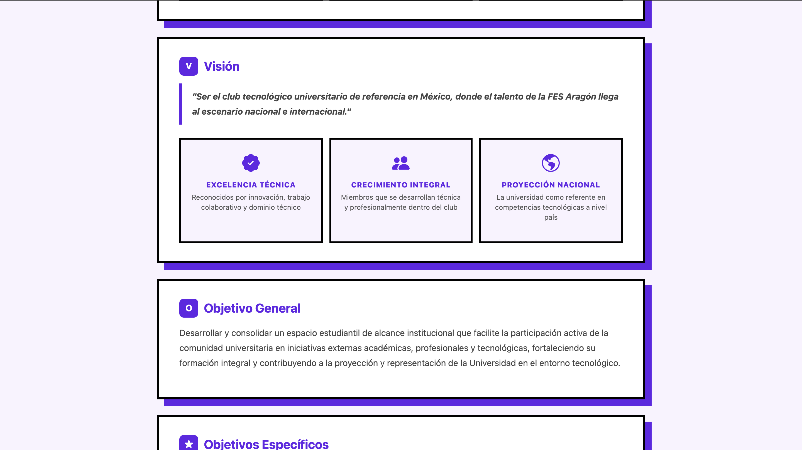
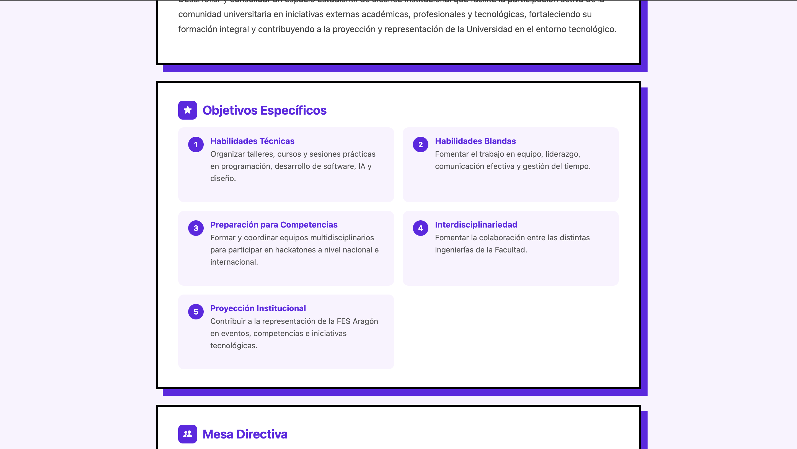
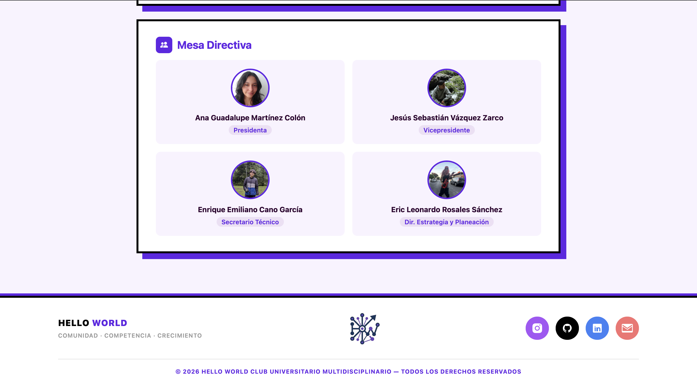

# Club Hello World — Documentación Técnica

> Sitio web oficial de la participación de nuestro equipo del Club Hello World, comunidad tecnológica universitaria de la **FES Aragón, UNAM**.
> Desarrollado como proyecto del Hackatón: Diseña nuestra página Web.

---

## Índice

1. [Descripción del Proyecto](#1-descripción-del-proyecto)
2. [Tecnologías Implementadas](#2-tecnologías-implementadas)
3. [Estructura del Proyecto](#3-estructura-del-proyecto)
4. [Páginas y Funcionalidad](#4-páginas-y-funcionalidad)
5. [Decisiones Técnicas Relevantes](#5-decisiones-técnicas-relevantes)

---

## 1. Descripción del Proyecto

El sitio web del Club Hello World es una aplicación web estática de múltiples páginas que sirve como presencia digital del club. Presenta la oferta de eventos y hackathones, un ranking de miembros, un formulario de registro y la información institucional del club.

El diseño sigue una estética **neo-brutalist**: bordes sólidos de 4px, sombras con offset visible en el color primario `#6225e6`, tipografía bold en mayúsculas y contrastes fuertes entre blanco y negro.

---

## 2. Tecnologías Implementadas

### Frontend

| Tecnología | Versión | Uso |
|---|---|---|
| **HTML5** | — | Estructura semántica de todas las páginas |
| **CSS3** | — | Estilos personalizados, animaciones, layout |
| **JavaScript** | ES6+ | Interactividad: carrusel, typewriter, contadores, formulario |
| **Bootstrap** | 5.3.8 | Grid system, clase `container` para el header |
| **Bootstrap Icons** | 1.11.3 | Íconos en la página Nuestro Club |
| **Google Fonts** | — | Tipografías *DM Sans* y *Playfair Display* (Ranking y Oferta) |

### Servicios Externos

| Servicio | Uso |
|---|---|
| **Formspree** | Backend de envío del formulario de registro (`/f/xkoqogyo`) |
| **Google reCAPTCHA v3** | Protección anti-spam en el formulario de Únete |

### CDNs utilizados

```
https://cdn.jsdelivr.net   → Bootstrap CSS + JS
https://fonts.googleapis.com → Google Fonts
https://www.google.com/recaptcha → reCAPTCHA
```

---

## 3. Estructura del Proyecto

El proyecto sigue una **arquitectura de carpetas por página**: cada subpágina tiene su propio directorio con su HTML, CSS y JS asociados. Los recursos compartidos (estilos globales, imágenes, JS del inicio) permanecen en la raíz.

```
ClubHelloWorld/
│
├── index.html              ← Página de inicio
├── index.js                ← JS: carrusel + terminal typewriter + contadores
├── styles.css              ← CSS global compartido por todas las páginas
│
├── img/                    ← Imágenes compartidas
│   ├── favicon.svg / favicon.png
│   ├── logo.png
│   ├── logoclub2.jpeg      ← Carrusel slide 1
│   ├── hackathon.jpg       ← Carrusel slide 2
│   ├── fes2.jpeg           ← Carrusel slide 3
│   └── ana/sebas/cano/eric.jpeg  ← Fotos mesa directiva
│
├── nuestro_club/
│   ├── nuestro_club.html   ← Misión, visión, objetivos, mesa directiva
│   └── nuestro_club.css    ← Estilos exclusivos de esta página
│
├── oferta/
│   ├── oferta.html         ← Carruseles de hackathones, cursos y eventos
│   ├── stylesOferta.css    ← Estilos de tarjetas y carruseles horizontales
│   └── oferta.js           ← JS: scroll de carruseles + apertura de cards
│
├── unete/
│   ├── unete.html          ← Formulario de registro al club
│   ├── formulario.css      ← Estilos del formulario y botón CTA
│   └── unete.js            ← JS: validación reCAPTCHA + envío a Formspree
│
├── ranking/
│   ├── ranking.html        ← Podio top 3 + tabla de clasificación
│   ├── ranking.css         ← Estilos del podio, tabla y barras de progreso
│   └── ranking.js          ← JS: render del ranking + animación de barras
│
└── docs/                   ← Documentación del proyecto
    ├── README.md           ← Este archivo
    └── img/                ← Capturas de pantalla de la interfaz
```

---

## 4. Páginas y Funcionalidad

### 4.1 Inicio (`index.html`)

Página principal del sitio. Contiene dos secciones interactivas principales.

**Carrusel de imágenes**
- Implementado con radio inputs de HTML + CSS puro (`translateX` para el deslizamiento).
- 3 slides con navegación por flechas y puntos indicadores.
- Autoplay cada 5 segundos; se pausa 10 segundos tras interacción manual.

**Sección Terminal + Stats**
- Terminal animada con efecto **typewriter** (escritura carácter por carácter).
- Simula una sesión de shell mostrando información del club.
- 4 tarjetas de estadísticas con **contadores animados** activados por `IntersectionObserver` al hacer scroll.




---

### 4.2 Oferta (`oferta/oferta.html`)

Muestra la oferta de eventos del club dividida en tres categorías: Hackathones, Cursos y Eventos.

- Cada categoría tiene un **carrusel horizontal** con desplazamiento suave (`scroll-snap-type: x mandatory`).
- Las tarjetas tienen barras de navegación `←` `→` que mueven el scroll por el ancho exacto de una tarjeta.
- Cada tarjeta abre un enlace externo al hacer clic (manejado mediante atributo `data-url` + event listener, sin `onclick` inline).
- Scrollbar oculto en todos los navegadores (`scrollbar-width: none` + `::-webkit-scrollbar`).




---

### 4.3 Ranking (`ranking/ranking.html`)

Tabla de clasificación de miembros con dos vistas:

- **Podio visual** para los 3 primeros lugares, con barras de progreso animadas al cargar.
- **Tabla extendida** para el resto de participantes, también con barras animadas.
- El orden visual del podio sigue la convención deportiva: 2º — 1º — 3º.
- Los datos de participantes son un arreglo en `ranking.js`, fácilmente editable.



---

### 4.4 Únete (`unete/unete.html`)

Formulario de registro para nuevos miembros del club.

- Campos: nombre completo, correo institucional y motivo de interés.
- **Etiquetas flotantes** con transición CSS (el label sube al enfocarse el input).
- Validación de **Google reCAPTCHA v3** antes de permitir el envío.
- Envío asíncrono con `fetch` a **Formspree**; muestra mensajes de éxito/error sin recargar la página.



---

### 4.5 Nuestro Club (`nuestro_club/nuestro_club.html`)

Página institucional del club con cuatro secciones:

- **Misión** — declaración y tres pilares (Alto Rendimiento, Habilidades Técnicas, Impacto Profesional).
- **Visión** — declaración y tres pilares (Excelencia Técnica, Crecimiento Integral, Proyección Nacional).
- **Objetivos Específicos** — lista numerada de 5 objetivos.
- **Mesa Directiva** — grid de fotos y cargos de los 4 integrantes fundadores.






---

## 5. Decisiones Técnicas Relevantes

### 5.1 Sitio estático multi-página sin framework

Se optó por **HTML/CSS/JS vanilla** sin ningún framework de JavaScript (React, Vue, etc.) ni generador de sitios estáticos. Esto garantiza:
- **Cero dependencias de build**: el sitio funciona abriendo los archivos directamente.
- **Máxima portabilidad**: puede desplegarse en cualquier hosting estático.
- **Curva de aprendizaje mínima** para colaboradores nuevos al club.

### 5.2 Un archivo JS por página

Cada página tiene su propio archivo JavaScript independiente (`index.js`, `oferta.js`, `unete.js`, `ranking.js`). Esta decisión facilita:
- Entender la lógica de cada página de forma aislada.
- Evitar cargar JavaScript innecesario en páginas que no lo requieren.
- `nuestro_club.html` no tiene JS propio porque no necesita interactividad.

Todos los scripts usan el atributo `defer` para no bloquear el renderizado del HTML.

### 5.3 Carrusel CSS puro (sin librería)

El carrusel de la página de inicio no utiliza ninguna librería externa. Funciona con:
- **Radio inputs ocultos** (`<input type="radio">`) que actúan como estado.
- **Selector CSS `:checked`** para mostrar/ocultar flechas de navegación según el slide activo.
- **`translateX`** en el contenedor de slides para el desplazamiento.
- **JavaScript solo para el autoplay**, detección de clics y sincronización con los dots.

Esto elimina una dependencia de librería (~30KB menos) y mejora el rendimiento.

### 5.4 Carruseles horizontales con scroll nativo

Los carruseles de tarjetas en la página de Oferta utilizan scroll horizontal nativo del navegador en lugar de un componente custom. Tecnologías usadas:
- `overflow-x: auto` + `scroll-snap-type: x mandatory` para snap suave al hacer scroll.
- `scroll-snap-align: start` en cada tarjeta.
- `scrollbar-width: none` para ocultar la barra en Firefox; `::webkit-scrollbar { display: none }` para Chrome/Safari.
- Botones `←` `→` calculan el ancho exacto de una tarjeta (`card.offsetWidth + gap`) y usan `scrollBy()` con `behavior: smooth`.

### 5.5 Atributos `data-url` en lugar de `onclick` inline

Las tarjetas de eventos abrían sus enlaces mediante `onclick="window.open(...)"` inline. Se refactorizó a:
```html
<div class="card" data-url="https://...">
```
```js
document.querySelectorAll('.card[data-url]').forEach(card => {
    card.addEventListener('click', () => window.open(card.dataset.url, '_blank'));
});
```
Esto separa el comportamiento del markup, mejora la mantenibilidad y elimina código JavaScript del HTML.

### 5.6 Optimizaciones Lighthouse (rendimiento > 90)

Se aplicaron las siguientes optimizaciones orientadas a obtener una puntuación alta en Google Lighthouse:

| Optimización | Impacto |
|---|---|
| Eliminación del CDN de Tailwind (nunca utilizado, ~200KB) | Performance ↑↑ |
| `defer` en todos los scripts externos | Performance ↑ (no render-blocking) |
| `fetchpriority="high"` en la imagen LCP del carrusel | LCP ↑ |
| `loading="lazy"` en imágenes below-the-fold | Performance ↑ |
| `width` y `height` en todas las imágenes | CLS = 0 (sin layout shift) |
| `<link rel="preconnect">` para jsDelivr y Google Fonts | TTFB ↓ |
| `<meta name="description">` en las 5 páginas | SEO = 100 |

### 5.7 HTML semántico y accesibilidad (WCAG)

El código usa elementos semánticos de HTML5 para garantizar compatibilidad con lectores de pantalla y tecnologías asistivas:

- `<header>`, `<main>`, `<footer>`, `<nav>`, `<section>` en lugar de `<div>` genéricos.
- `aria-label` en `<nav>`, controles del carrusel, hamburger menu y enlaces de redes sociales.
- Jerarquía de headings correcta: `<h1>` único por página, seguido de `<h2>` y `<h3>`.
- `<h1 class="visually-hidden">` en `index.html` para que los lectores de pantalla identifiquen la página sin afectar el diseño visual.
- Eliminación del patrón `<a><button>` (elementos interactivos anidados, inválido en HTML5) en los iconos sociales del footer.
- `rel="noopener noreferrer"` en todos los enlaces con `target="_blank"`.

---

*Documentación generada para el Hackatón: Diseña nuestra página Web. — FES Aragón, UNAM.*
